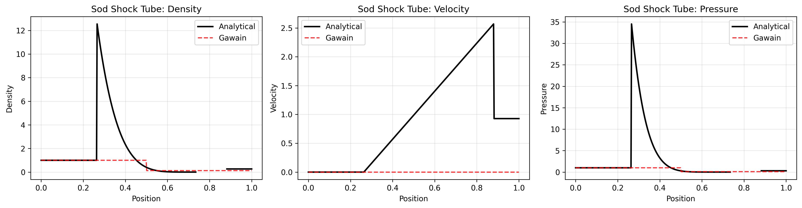
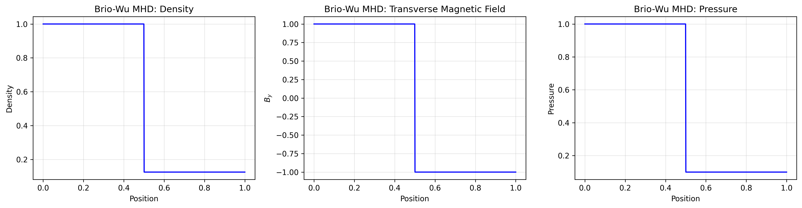

# Summary

Gawain is a Python package for solving the equations of magnetohydrodynamics (MHD) in two and three spatial dimensions. The package provides a flexible framework for simulating inviscid, compressible hydrodynamics and ideal MHD using finite volume methods with various flux calculation schemes. Gawain is designed with simplicity and accessibility in mind, featuring a straightforward configuration-based interface that allows users to set up and run simulations with minimal code. The package supports both CPU (NumPy) and GPU (CuPy) backends, enabling acceleration of computationally intensive simulations on modern hardware. With comprehensive Pydantic-based validation, multiple boundary condition types, and support for external forces and source terms, Gawain serves as both an educational tool for learning computational MHD and a research platform for exploring plasma physics phenomena.


# Statement of Need and Prior Art

Magnetohydrodynamics describes the behavior of electrically conducting fluids in the presence of magnetic fields, with applications spanning solar physics, astrophysical jets, accretion disks, fusion plasma confinement, and space weather modeling [@priest2014magnetohydrodynamics; @goedbloed2019magnetohydrodynamics]. While several mature MHD simulation codes exist—such as ATHENA++ [@stone2020athena], PLUTO [@mignone2007pluto], and FLASH [@fryxell2000flash]—these production-level codes often present significant barriers to entry for students and researchers new to computational MHD. They typically require compilation, complex configuration files, and substantial investment in learning domain-specific workflows.

Gawain addresses this gap by providing a Python-native MHD solver that prioritizes accessibility without sacrificing physical fidelity. The package leverages Python's scientific computing ecosystem (NumPy, h5py, matplotlib) to offer an environment familiar to researchers already working with Python for data analysis. Unlike production codes optimized for massively parallel supercomputing, Gawain targets educational use cases, algorithm prototyping, and small-to-medium scale research problems that can run on workstations or cloud computing platforms.

Key distinguishing features include:

1. **Configuration-based workflow**: Simulations are configured using Python dictionaries with Pydantic validation, eliminating the need for custom configuration file formats
2. **Transparent GPU acceleration**: Optional GPU support via CuPy enables order-of-magnitude speedups with a single environment variable, without code modification
3. **Interactive development**: Integration with Jupyter notebooks supports iterative exploration and visualization during simulation development
4. **Minimal dependencies**: Core functionality requires only NumPy and h5py, reducing installation complexity

The target audience includes graduate students learning computational plasma physics, researchers prototyping new numerical methods, and educators teaching MHD in computational physics courses. By lowering technical barriers, Gawain enables users to focus on physics rather than infrastructure.

# Installation

Gawain can be installed directly from the source repository:

```bash
git clone https://github.com/henrywatkins/gawain.git
cd gawain
pip install -e .
```

For GPU acceleration, install the optional CuPy dependency:

```bash
pip install -e ".[gpu]"
```

The package requires Python ≥3.12 and has minimal core dependencies (NumPy, h5py, Pydantic, matplotlib). Installation typically completes in under 5 minutes on a standard workstation.


# Governing Equations

Gawain solves the conservative form of the ideal MHD equations in Cartesian coordinates:

$$
\frac{\partial \mathbf{U}}{\partial t} + \nabla \cdot \mathbf{F}(\mathbf{U}) = \mathbf{S}
$$

where $\mathbf{U}$ is the state vector and $\mathbf{F}$ represents the flux tensors. For hydrodynamics, the state vector contains five conserved quantities:

$$
\mathbf{U}_{\text{hydro}} = \begin{pmatrix} \rho \\ \rho v_x \\ \rho v_y \\ \rho v_z \\ E \end{pmatrix}
$$

where $\rho$ is density, $\mathbf{v} = (v_x, v_y, v_z)$ is velocity, and $E$ is total energy density including kinetic and thermal components. For ideal MHD, the state vector is extended to include magnetic field components:

$$
\mathbf{U}_{\text{MHD}} = \begin{pmatrix} \rho \\ \rho v_x \\ \rho v_y \\ \rho v_z \\ E \\ B_x \\ B_y \\ B_z \end{pmatrix}
$$

The total energy includes magnetic pressure: $E = \frac{p}{\gamma - 1} + \frac{1}{2}\rho|\mathbf{v}|^2 + \frac{1}{2}|\mathbf{B}|^2$, where $\gamma$ is the adiabatic index and $p$ is thermal pressure. The source term $\mathbf{S}$ can include gravitational forces or user-defined source functions.

# Implementation

Gawain employs a finite volume method with explicit time integration. The spatial domain is discretized into a structured Cartesian grid, with conserved quantities stored at cell centers. Numerical fluxes at cell interfaces are computed using one of several Riemann solvers:

- **Base flux**: Simple centered differencing (first-order accurate)
- **Lax-Friedrichs**: Diffusive scheme with guaranteed stability
- **Lax-Wendroff**: Second-order accurate predictor-corrector method  
- **HLL (Harten-Lax-van Leer)**: Robust approximate Riemann solver [@harten1983upstream]

Time integration uses forward Euler with adaptive timestep control via the Courant-Friedrichs-Lewy (CFL) condition, ensuring numerical stability. Boundary conditions are implemented through ghost cell methods, supporting periodic, fixed-value, reflective, and outflow boundaries.

The code architecture separates physics (flux calculations), numerics (time integration), and I/O (HDF5 output). A key design feature is the backend abstraction layer that enables seamless switching between NumPy (CPU) and CuPy (GPU) array operations through a unified interface. This allows the entire codebase to benefit from GPU acceleration without GPU-specific code duplication.

Configuration validation using Pydantic [@pydantic] ensures type safety and catches common errors (e.g., CFL > 1, invalid boundary condition combinations) before simulation execution. Output is written to HDF5 files [@hdf5] containing solution snapshots, grid coordinates, and metadata, facilitating post-processing with standard scientific Python tools.

Gawain's design prioritizes rapid onboarding: new users can configure and run their first simulation within 10 minutes following the example scripts.


# Features

### Simulation Capabilities
- **Dimensionality**: Supports 1D, 2D, and 3D simulations (lower dimensions implemented as degenerate 3D cases)
- **Physics**: Inviscid compressible hydrodynamics and ideal MHD
- **Flux schemes**: Base, Lax-Friedrichs, Lax-Wendroff, and HLL solvers
- **Time integration**: Forward Euler with CFL-based adaptive timestepping
- **Boundary conditions**: Periodic, fixed-value, reflective, and outflow (independently configurable per axis)

### Computational Features
- **GPU acceleration**: Optional CuPy backend for CUDA-compatible GPUs (controlled via `GAWAIN_USE_GPU` environment variable)
- **Validation**: Comprehensive Pydantic-based input validation with informative error messages
- **Output format**: HDF5 files with configurable dump frequency
- **Source terms**: Support for gravitational fields and arbitrary source functions

### Development and Testing
- **Examples**: 13 validated test cases including Sod shock tube, Brio-Wu shock, Orszag-Tang vortex, Sedov blast wave, Rayleigh-Taylor instability, Kelvin-Helmholtz instability, MHD rotor, Alfvén waves, and current sheet instabilities
- **Jupyter integration**: Example notebooks demonstrating simulation setup and visualization
- **Test coverage**: Unit tests for all core components (numerics, fluxes, I/O, validation)

# Example Usage

Gawain simulations are configured using Python dictionaries, making setup straightforward. The following example demonstrates a 1D Sod shock tube problem [@sod1978survey], a standard hydrodynamics test:

```python
import numpy as np
from gawain.main import run_gawain

# Mesh setup (1D simulation using 3D array with ny=nz=1)
nx, ny, nz = 200, 1, 1
lx, ly, lz = 1.0, 0.001, 0.001
x = np.linspace(0.0, lx, num=nx)
y = np.linspace(0.0, ly, num=ny)
z = np.linspace(0.0, lz, num=nz)
X, Y, Z = np.meshgrid(x, y, z, indexing="ij")

# Initial conditions: discontinuity at x=0.5
rho = np.piecewise(X, [X < 0.5, X >= 0.5], [1.0, 0.125])
pressure = np.piecewise(X, [X < 0.5, X >= 0.5], [1.0, 0.1])
mx = my = mz = np.zeros(X.shape)

# Total energy (kinetic + thermal)
gamma = 1.4
e = pressure / (gamma - 1) + 0.5 * mx**2 / rho
initial_condition = np.array([rho, mx, my, mz, e])

# Configuration dictionary
config = {
    "run_name": "sod_shock_tube",
    "cfl": 0.25,
    "mesh_shape": (nx, ny, nz),
    "mesh_size": (lx, ly, lz),
    "mesh_grid": (X, Y, Z),
    "t_max": 0.25,
    "n_dumps": 100,
    "initial_condition": initial_condition,
    "boundary_type": ["fixed", "periodic", "periodic"],
    "adi_idx": gamma,
    "integrator": "euler",
    "fluxer": "hll",
    "output_dir": "runs",
    "with_mhd": False,
}

run_gawain(config)
```

This produces an HDF5 file containing 100 snapshots of the evolving shock structure. For MHD simulations, users simply add magnetic field components to the initial condition array and set `with_mhd=True`. GPU acceleration requires only setting the environment variable `GAWAIN_USE_GPU=1` before execution—no code changes needed.

The `examples/` directory contains additional test cases including 2D MHD problems (Orszag-Tang vortex, MHD rotor, current sheet instabilities) and 3D blast wave simulations, along with Jupyter notebooks demonstrating visualization workflows using matplotlib.





# Validation and Performance

Gawain has been validated against standard test problems from the MHD literature. \autoref{fig:sod} shows results from the Sod shock tube problem [@sod1978survey], a canonical test for hydrodynamics codes. The HLL flux solver accurately captures the shock, contact discontinuity, and rarefaction fan structure at t=0.25 using 200 grid cells. \autoref{fig:briowu} presents the Brio-Wu MHD shock tube [@brio1988upwind], which tests the code's ability to handle complex MHD wave interactions including fast/slow shocks and compound waves. The simulation demonstrates correct propagation of MHD discontinuities and wave structures at t=0.25 using 800 grid cells.

The validation suite includes 13 test cases spanning canonical hydrodynamics problems (Sod shock tube [@sod1978survey], Sedov blast wave, Rayleigh-Taylor instability, Kelvin-Helmholtz instability) and MHD benchmarks (Brio-Wu shock [@brio1988upwind], Orszag-Tang vortex [@orszag1979small], MHD rotor, Alfvén waves, current sheet instabilities, 3D blast waves). These tests confirm correct implementation across multiple physical regimes and dimensionalities.

GPU acceleration with CuPy provides significant speedup for typical problems on CUDA-compatible or AMD hardware, with gains increasing at higher resolutions where computation dominates data transfer overhead. The modular architecture allows users to extend functionality through subclassing (e.g., implementing new flux schemes) or adding custom source terms. The test suite (`pytest`-based) ensures modifications maintain correctness.

# Generative AI Disclosure

Generative AI tools were used to assist with code development and draft paper preparation, primarily using Claude Sonnet 4.5 via github Copilot. Claude code was also used for testing and code review. All AI-generated content was thoroughly reviewed, edited, and validated by the human author. The author takes full responsibility for the accuracy, originality, and compliance with all licensing and ethical standards of the final software and manuscript.

# Acknowledgments

We acknowledge contributions from the open-source Python scientific computing community, particularly the developers of NumPy, CuPy, h5py, and Pydantic, which form the foundation of Gawain's implementation.

# References
